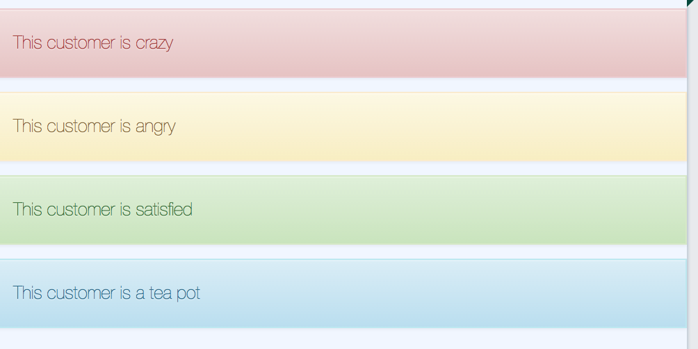

# lbs-alert
Component for showing messages



Param           | Explanation                     | Example value               | Default value
--------------- | ------------------------------- |---------------              | -------------
text            | Text to be displayed            | 'Call this customer!'       | ''
icon            | Optional Font Awesome icon      | 'fa-exclamation-triangle'   | null
alertType       | Type of alert                   | 'warning'                   | 'info'

List of alert types and their corresponding colors:
* warning: yellow
* info: blue
* danger: red
* success: green

!!! info
    See [Font Awesome 4 docs](https://fontawesome.com/v4.7.0/) for available icons

## Child elements
If you want to add custom content to your alert, you can add this as child elements to the component.

## Usage
```
<lbs-alert params="text: 'This customer is satisfied', alertType: 'success'"></lbs-alert>
```
Or
```
<lbs-alert params="alertType: 'danger'">
	<lbs-icon params="icon: 'fa-exclamation'"></lbs-icon>
	<span>Customer is maaad!</span>
</lbs-alert>
```