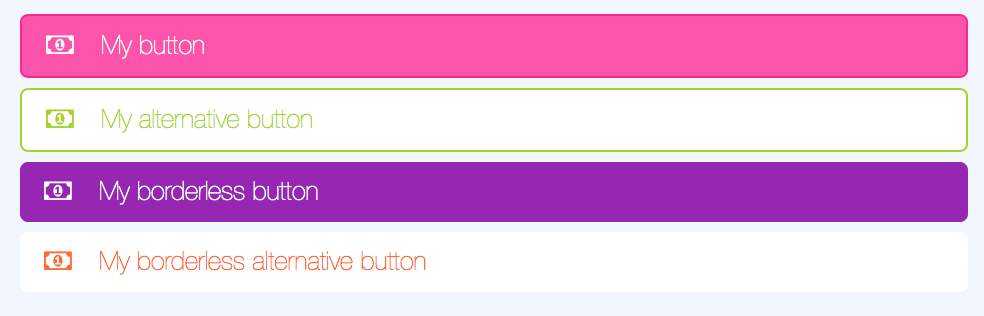
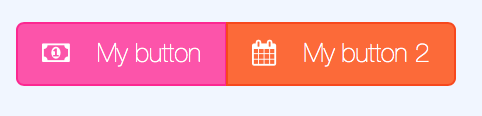
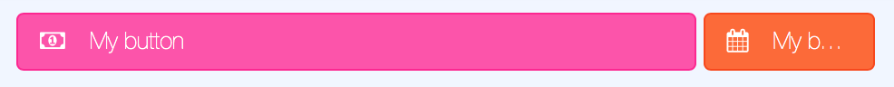
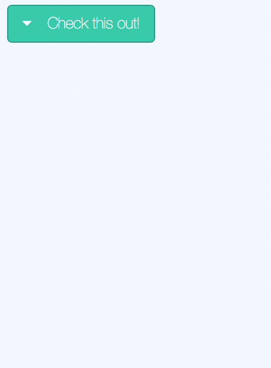

## lbs-button
Lime specific button which can be styled using the official colors of Lime Bootstrap. These buttons will always have width 100% but will otherwise follow the Twitter Bootstrap styling.



### Params
Param           | Explanation                                      | Example value  | Default value
--------------- | -------------------------------                  |--------------- | -------------
color           | One of LBS standard colors                       | 'lime-green'   | 'turquoise'
bootstrapClass  | One of Bootstrap button classes                  | 'btn-success'  | ''
icon            | Font awesome icon of your choice                 | 'fa-calendar'  | null
text            | Text on your button                              | 'My button'    | ''
centered        | Boolean for centering text                       | true           | false
fullWidth       | Boolean if button should be full width           | false          | true
alternative     | Boolean if button should be styled alternatively | true           | false
borderless      | Boolean if button border should be excluded      | true           | false

!!! info
    See [Font Awesome 4 docs](https://fontawesome.com/v4.7.0/) for available icons

!!! warning
    You cannot combine the params _color_ and _bootstrapClass_.

### Usage
```
<lbs-button params="text: 'My button', color: 'magenta', icon: 'fa-money'"></lbs-button>
```

----------------


## lbs-button-group
A component to group buttons together. Removes margins and border radius for edges between buttons.
#### Params
No params available




### Child elements
The component `lbs-button-group` can be used with two different child elements:
* Twitter Bootstrap buttons (using class `.btn`)
* LBS buttons (using component `lbs-button`)

### Usage
Using lbs-buttons:
```
<lbs-button-group>
    <lbs-button params="text: 'My button', color: 'magenta', icon: 'fa-money'"></lbs-button>
    <lbs-button params="text: 'My button 2', color: 'orange', icon: 'fa-calendar'"></lbs-button>
</lbs-button-group>
```
Using Twitter Bootstrap buttons:
```
<lbs-button-group>
    <button class="btn btn-default" data-bind="icon: 'fa-money', text: 'My button'"></button>
    <button class="btn btn-success" data-bind="icon: 'fa-calendar', text: 'My button 2'"></button>
</lbs-button-group>
```

---------------------

## lbs-split-button
A component to group two buttons together. The first button will take 80% of the width of the component and the second one 20%.



### Params
No params available

### Child elements
The component `lbs-split-button` can be used with two different child elements:
* Twitter Bootstrap buttons (using class `.btn`)
* LBS buttons (using component `lbs-button`)

### Usage
Using lbs-buttons:
```
<lbs-split-button>
    <lbs-button params="text: 'My button', color: 'magenta', icon: 'fa-money'"></lbs-button>
    <lbs-button params="text: 'My button 2', color: 'orange', icon: 'fa-calendar'"></lbs-button>
</lbs-split-button>
```
Using Twitter Bootstrap buttons:
```
<lbs-split-button>
    <button class="btn btn-default" data-bind="icon: 'fa-money', text: 'My button'"></button>
    <button class="btn btn-success" data-bind="icon: 'fa-calendar', text: 'My button 2'"></button>
</lbs-split-button>
```

-------------------

## lbs-dropdown-menu
Component for listing items with optional actions.



### Params
Param           | Explanation                     | Example value      | Default value
--------------- | ------------------------------- | ------------------ | --------------
color           | Button color                    | 'magenta'          | 'turquoise'
title            | Optional button text           | 'Check this out!'  | ''
icon            | Optional Font Awesome icon      | 'fa-ellipsis-v'    | 'fa-chevron-down'
fullWidth       | Boolean if full width button    | true | false
heroMenu        | Used by lbs-hero. Should probably not be used outside of that | false | false
borderless      | Boolean if button border should be excluded | true | false
items           | Array with objects in the dropdown menu. | See below | []

### Item configuration
Param           | Explanation                     | Example value      | Default value
--------------- | ------------------------------- | ------------------ | --------------
label           | Text shown in the list item     | 'Postpone'         | ''
icon            | Optional icon to the left of the text | 'fa-user'    | ''
click           | Javascript function to run on click | () => { alert('Hi') } | null
vba             | VBA sub to run on click. Can be combined with click. | 'Module.Sub' | null
type            | _item_ or _divider_             | 'item'             | 'item'

__Note__: All other parameters will be disregarded if type is set to _divider_.

### Usage
```
<lbs-dropdown-menu params="title: 'Check this out!', items: [{ label: 'My menu item', icon: 'fa-bowling-ball' }]">
    <lbs-list-item params="text: 'Additional item!', icon: 'fa-calendar'"></lbs-list-item>
</lbs-dropdown-menu>
```