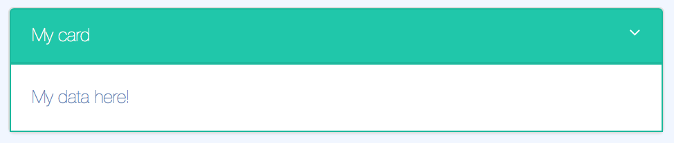

# lbs-card
A card like component to use to put other components in



## Params
Param           | Explanation                                   | Example value                 | Default value
--------------- | -------------------------------               |-------------------            | -------------
color           | One of LBS standard colors                    | 'lime-green'                  | 'turquoise'
title           | Header text for the card                      | 'Lime Technologies'           | ''
icon            | Name of the header icon                       | 'fa-calendar'                 |
expandable      | Set if card body can be expanded or not       | `true` or `false`             | `true`
expanded        | Default expanded state                        | `true` or `false`             | `true`

!!! info
    The component will save the expanded state in a cookie. Thus a user will find the cards in the same way she left them as long as they are on the same machine

## Usage
```
<lbs-card params="title: 'My card'">
    <div> My data here! </div>
</lbs-card>
```

