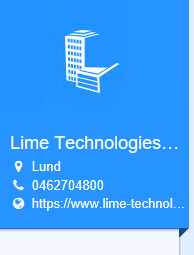
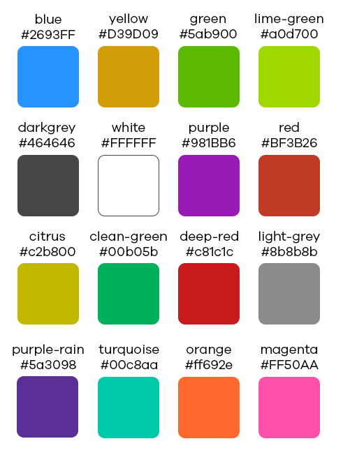

# lbs-hero
Component for adding a hero (banner like header) for an actionpad.




## Params
Param           | Explanation                                   | Example value                 | Default value
--------------- | -------------------------------               |-------------------            | -------------
color           | One of LBS standard colors                    | 'lime-green'                  | 'turquoise'
header          | Header text for the hero                      | 'Lime Technologies'           | ''
img             | Name of the header image                      | 'fa-calendar'                 |
menuItems       | Array with objects defining a context menu.   | [See below](#context-menu)    | []



## Context menu
The context menu is automatically added to the lbs-hero component if the array `menuItems` is supplied and has more than 0 elements. Each element in the array has the following options:

Param           | Explanation                     | Example value      | Default value
--------------- | ------------------------------- | ------------------ | --------------
label           | Text shown in the list item     | 'Postpone'         | ''
icon            | Optional icon to the left of the text | 'fa-user'    | ''
click           | Javascript function to run on click | () => { alert('Hi') } | null
vba             | VBA sub to run on click. Can be combined with click. | 'Module.Sub' | null
type            | _item_ or _divider_             | 'item'             | 'item'

!!! info
    All other parameters will be disregarded if type is set to _divider_.

!!! warning
    You need to supply the image to the dist/resource/ folder if the name of the image is anything else than _dist/resource/classname.png_.

## Usage
```
<lbs-hero params="header: company.name, menuItems: [{ label: 'My hero item', icon: 'fa-bowling-ball' }]">
    <lbs-list-item params="text: company.visitingcity, icon: 'fa-map-marker'" data-bind="openMap: company.fullvisitingaddress"></lbs-list-item>
    <lbs-list-item params="text: company.phone, call: company.phone, icon: 'fa-phone'" data-bind="call: company.phone"></lbs-list-item>
    <lbs-list-item params="text: company.www, openURL: company.www, icon: 'fa-globe'" data-bind="openURL: company.www"></lbs-list-item>
</lbs-hero>
```