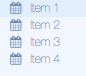

## lbs-list-item


Component for list items in various LBS components that implement these.

!!! info
    Must be used inside a `ul`-like component, such as [`lbs-menu`](lbs-menu) or [lbs-dropdown-menu](lbs-dropdown-menu)


### Params
Param           | Explanation                     | Example value      | Default value
--------------- | ------------------------------- |------------------- | -------------
text            | Text for the list item          | 'Call mom'         | ''
icon            | Optional Font Awesome icon      | 'fa-phone'         |

### Usage

```
...
<lbs-list-item params="text: 'Postpone todo', icon: 'fa-calendar'"></lbs-list-item>
...
```

!!! info
    See [Font Awesome 4 docs](https://fontawesome.com/v4.7.0/) for available icons


--------------------


## lbs-list-divider
Component for creating a list divider in various LBS components that implement these

!!! info
    Must be used inside a `ul`-like component, such as [`lbs-menu`](lbs-menu) or [lbs-dropdown-menu](lbs-dropdown-menu)

### Params
None

### Usage
```
...
<lbs-list-divider></lbs-list-divider>
...
```