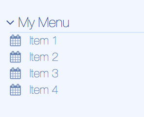

# lbs-menu
Expandable menu component.


## Params
Param           | Explanation                     | Example value      | Default value
--------------- | ------------------------------- |------------------- | -------------
title           | Title text for the menu         | 'Links'            | ''
expanded        | Boolean if expanded when first loaded | false        | true

## Child elements
The component `lbs-menu` should be used with one type of child element:
* LBS List item (`<lbs-list-item>`)

## Usage
```
<lbs-menu params="title: 'Links', expanded: true">
    <lbs-list-item params="text: 'Do funny stuff', icon: 'fa-calendar'" data-bind="click: runMyFunction"></li>
</lbs-menu>
```

!!! info
    The component will save the expanded state in a cookie. Thus a user will find the menues in the same way she left them as long as they are on the same machine