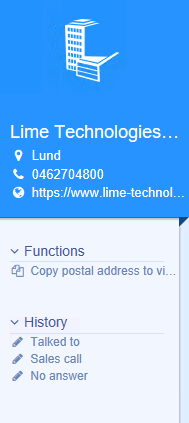

# Getting started

## A Lime Bootstrap Actionpad

An Actionpad built with Lime Bootstrap has the following structure:



```html
<lbs-hero params="header: company.name, img: company">
    <lbs-list-item params="text: company.visitingcity, icon: 'fa-map-marker'" data-bind="openMap: company.fullvisitingaddress"></li>
    <lbs-list-item params="text: company.phone, call: company.phone, icon: 'fa-phone'" data-bind="call: company.phone"></li>
    <lbs-list-item params="text: company.www, openURL: company.www, icon: 'fa-globe'" data-bind="openURL: company.www"></li>
</lbs-hero>


<lbs-menu params="title: 'Functions', expanded: true">
    <lbs-list-item params="text: 'Copy postal address', icon: 'fa-calendar'" data-bind="click: runMyFunction"></li>
</lbs-menu>

<lbs-menu params="title: 'History', expanded: true">
...
</lbs-menu>

```

An ActionPad built with Lime Bootstrap has two main components; a `View` and a `ViewModel`. Lime Bootstrap uses [knockoutjs](http://knockoutjs.com) [Model-View-ViewModel (MVVM)](https://en.wikipedia.org/wiki/Model–view–viewmodel) pattern.

### The view
The view is a piece of HTML which descripes where elements should be placed. In the view we `bind` the data and functions of the `ViewModel` to the view. Each ActionPad has an unique view, which is a partial html-file with the same name as the LimeType it is used with, for example `company.html``

In the `view `we make heavy use of `components`

### The ViewModel
The ViewModel is a Javascript object containing your data and functions to interact with the View. You don't have any direct access to the ViewModel when building ActionPads. For direct access to a ViewModel you need to create a [Custom Components](custom_components). You have some indirect access to the ViewModel of an ActionPad through specifing which [data sources](datasources) should be used in the file `_config.js`.

## Configuration
All framework configuration is done in the file `_config.js`. Here you can load additional data, enabling the debug mode or load custom components.

```javascript
lbs.externalConfig = {

	/*
	Enable or disable the debug-logging
	*/
    debug: true,

    /*
	Verbose levels:
	    debug	: 	Shows all log levels
        info	: 	Shows information level and up
        warn	: 	Shows warning level and up
        error	: 	Shows only error level logs
    */
    verboseLevel: 'warn',

    /*
    Load custom components
    */
    components: [
        { name: 'my-component', path: 'components/my-comp/my-comp.js' }
    ]

    /*
    Datasources to be used for each view
    */
	config:{
		helpdesk : {
		    dataSources: [
		    	{ type: 'activeLimeObject', embed: ['person'] },
		    	{ type: 'translation' },
		        { type: 'relatedLimeObjects', limetype: 'person', alias: 'person' },
		    ]
		}
	}
}

```

## Components

Components are self contained specialized html elements, for example `<lbs-hero>`. We are using [knockout components](http://knockoutjs.com/documentation/component-overview.html) behind the scenes to create the components, but in essens it is very inspired of the emerging webstandard of web components. Several components are [included](included_components) but you have also the ability to [build your own components](custom_components) or download community components from the [AppStore](https://appstore.lime-bootstrap.com)

See all our components [here](/en/latest/components)

## Custom Components and Apps
Lime Bootstraps allows you to create and custom components, as a compliment to the included components. Lime Bootstrap 1 had the concept of creating small apps. These apps still run fine in Lime Bootstrap 2.0, but it is prefered to use components.

Components and Apps can be found [here](http://limebootstrap.lundalogik.com/web/appstore/index.html)

A Custom Component is added in `_config.js` and can then be used in the same way as any included component.

To start an app add this HTML to your view:
```html

<div data-app="{app:'[Name of app]',
                config:{
                  [App config]
            }}">
</div>

```
Each app has it's own instructions how to start and install them. Some apps require VBA and/or stored procedures to be added.

## Translation
All available translations from the Localization table are automatically available in the actionpad context. The same language as the logged in user uses is automatically used. The translations are cached in a dictionary to increase speed, but requires you to run `ThisApplication.Setup` to rebuild the dictionary if you add translations or make changes.

```html
<li data-bind="text:localize.ActionPad_Todo.addTodo"></li>
```

The example below uses the versatile knockout binding `attr` to add a tooltip with localization support. It also uses the custom Lime Bootstrap bindings `vba` and `icon`.

```html
<li data-bind="vba:'Actionpad_Person.newComment', text:localize.Actionpad_Person.t_newcomment, icon:'fa-comment', attr: { title: localize.Actionpad_Person.tooltip_newcomment }"></li>
```

#### Technical notes
The translations are added to the global view model and are thus available in your apps.

Note that it is not possible to use localization in the standard way, e.g., `localize.Actionpad_Person.t_newcomment` within a block where you are using the knockout binding `with`.

## Fetching data from fields in Lime CRM
All fields from the ActiveInspector are automagically available for you to use in your view. The syntax is `[Record class name].[field database name].[property]`.

The available properties are (in order of relevance):
*   __.text__
*   __.value__
*   __.key__  - __available for set and list fields_
*   __.class__ - _available for relation fields_

```html
<!-- Company Actionpad showing the name of the company-->
<li data-bind="text:company.name.text"></li>
<!-- Shorthand--><li>{{company.name.text}}</li>
<!-- Person Actionpad using the id of the company relation as a parameter to a VBA-function. Note the Javascript syntax in the Knockout bindning  -->
<li data-bind="vba:'SomeFunction,' + person.company.value"></li>
<!-- Business Actionpad showing the optionKey from a set-list -->
<li data-bind="text:business.businesstatus.key"></li>
```

### Loading additional data
It is common to use data from more than the ActiveInspector and the following syntax will NOT work `<li data-bind="text:person.company.phone.text"></li>`

Instead you can load additional data by requesting data sources in `_config.js`.

The loaded data can then be access by:

All avialable data sources can be found [here](datasources)

```html
<!-- Loading person and company info on a helpdesk actionpad-->
<li data-bind="text:helpdesk.company.text"></li>
<li data-bind="text:person.phone.text"></li>
<li data-bind="text:person.mobilephone.text"></li>
<li data-bind="text:company.phone.text"></li>
```


## Keyboard shortcuts
The different view can be opened with shortcuts provided the actionpad is in focus.

|   Function  |   Command   |
|   ---    | ---       |
|   Reload actionpad | ctrl + shift + r |

